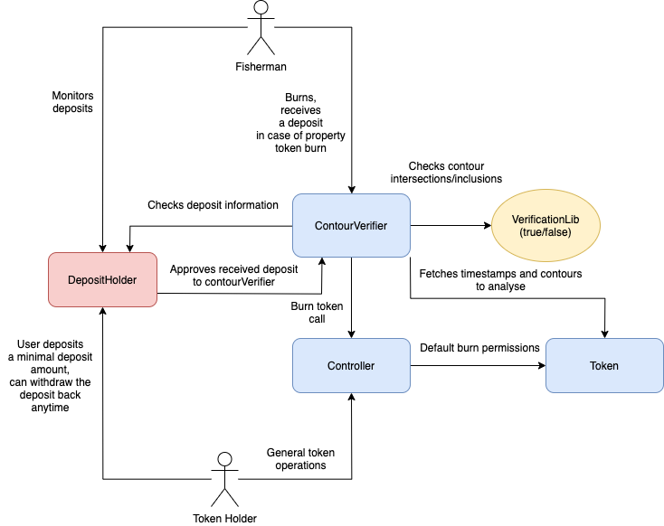

# Private property verification

* in the verification contract we already take into account the creation date of the token in the createdAt option (separate mapping)
we need to add a change account (we will write by keys in propertyExtraData https://github.com/galtproject/galtproject-private-property-registry/blob/c9300cb5661cf641cfc6721ada382d3638bf9ad5/contracts/PPToken.sol#L34)
contour + height contourUpdatedAt
  * other data (except contour + height) dataUpdatedAt
  * date of change of other data does not affect the uniqueness verification
* in the uniqueness check logic, we burn the token whose max (createdAt, contourUpdatedAt) is greater than the similar maximum of the second token, its data was changed later
* add trigger enable / disable verification of sections
* the period during which the owners of the plots need to replenish deposits is transferred to the verification inclusion method
* after enabling verification of the passage of the deposit period, the tokens of participants who do not make a deposit can be burned using the permissionless method
* the owner can also turn off verification at any time
* after turning off verification, each current token holder can withdraw his deposit back
* if after turning off the verification, the owner of the token is different from the owner of the token at creation, the current owner has the right to deposit
* we fasten the logic of checking the loops with a separate contract with rights (+ lib, everything does not fit), move the id-shniks of the two loops there, he takes or does not take the token
* The verifier has a separate unconditional right to the burn in the controller, which in turn execute the burn on the token itself
check
* controller keeps track of depositHolder address, the owner can change this address
* Token contract is not changeable
* a deposit amount can't be changed after enabling contour verification
* DepositHolder is a single contract which keeps deposits of different private property registries
* DepositHolder provides ContourVerification contract full permisssion on managing assets deposited by corresponding token holders
